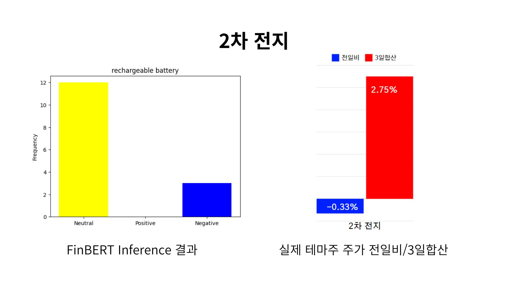
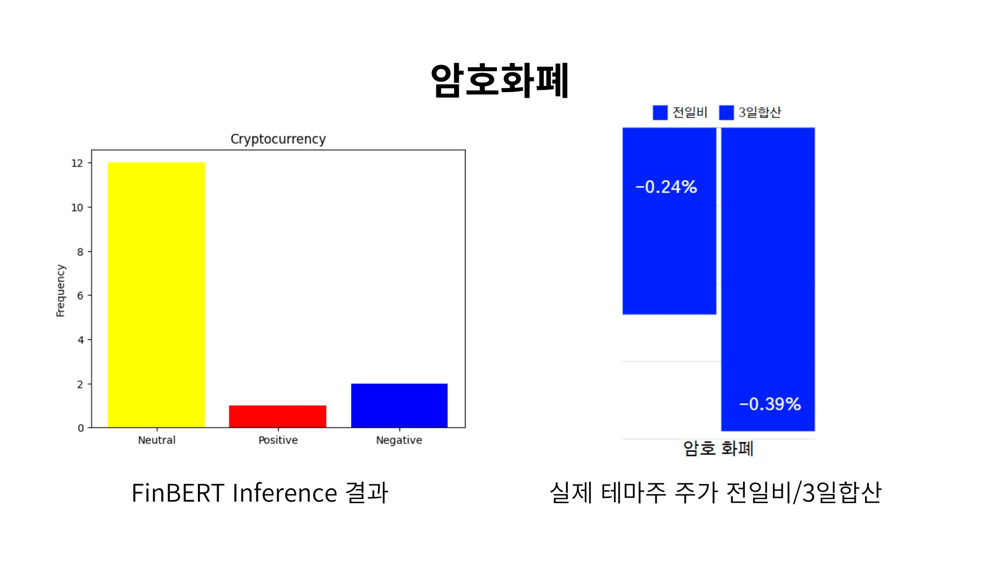
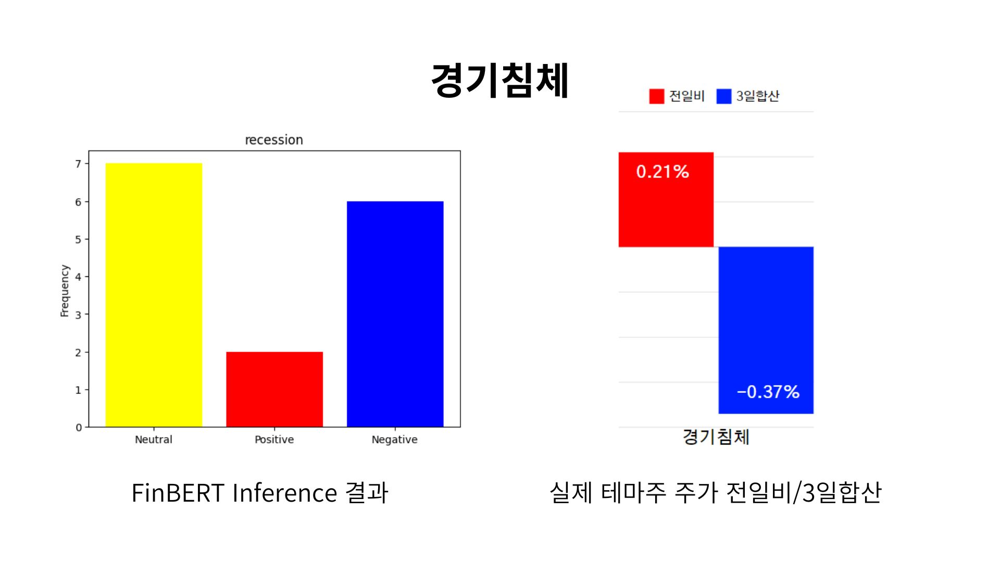
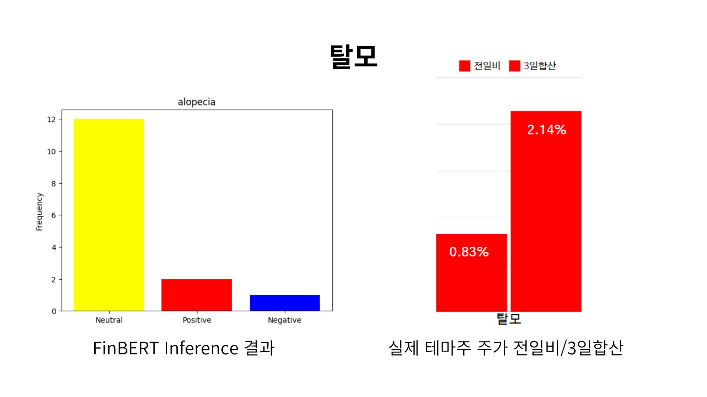

# Sentiment Analysis with FinBERT 💹
'썸트렌드'와 같은 브랜드 인사이트 제공 서비스에 대해 창업을 준비하다가, 브랜드에 대한 감정분석 데이터를 발견하고 구현해보고자 실행한 프로젝트이다. CNN에서 여러 테마주를 검색어로 지정한 후, '기사 제목'을 크롤링하여 감정분석을 진행하였다. <br> 
<br>
**기간** : 2023년 11월 <br>
**팀 소개 및 기여도** <br> 
- 김윤정 : 데이터 크롤링 및 FinBERT 구현
- 전필규 : 비즈니스 가치 창출
- 최인영 : 데이터 수집
<br>

## 서비스 개발 배경 및 문제 정의
개인들의 해외 직접 투자 증가 <br>
: 해외 추자 확대 2019년 대비 해외 주식 계좌수는 80만개에서 491만개로 약 600% 증가했다. 이러한 배경에서 개인투자자들이 정보 및 투자 손실을 보고있다는 사실을 접하게 되었다. 평균 개인 투자자 수익률인 14.4% 대비 신규 개인 투자자의 수익률은 -1.2%였다. 또한, 신규 개인 해외 투자자의 80%가 '정보 취득에 어려움을 느낀다'고 했다. <br> 

## 해결(Solution) 
테마주 감정 분석 서비스 <br>
: 키워드/테마를 설정하면 해당 테마와 관련된 뉴스를 크롤링해 분석하여 시장 전체 평가 긍/부정 평가 제공 <br>

## FinBERT? 
FinBERT란 대규모 금융 말뭉치로 Fine-Tuning한 BERT model이다. 일반 BERT와의 차이점은 다음과 같다. <br>
| | BERT | FinBERT |
|:---:|:---:|:---:|
| 훈련 데이터 | 다양한 텍스트 ex) 위키피디아 | 금융 관련 텍스트 ex) 주식 시장 보고서 |
| 적용 분야 | 다양한 자연어 처리 작업 | 금융 분야 특정 응용 프로그램 |
| 성능 | 일반적인 자연어 이해 작업 높은 성능 | 금융 관련 작업 높은 성능 |

FinBERT는 3가지 레이블에 대한 softmax output을 출력한다. <br>
- Positive (긍정)
- Negative (부정)
- Neutral (중립)

**성능** <br>
Kaggle의 Financial Sentiment Analysis 데이터셋을 활용하여 FinBERT 모델의 추론을 수행한 결과, **정확도는 0.76, F1 Score는 0.74**로 나타났다. 결과를 상세하게 분석한 결과, 사용된 데이터셋의 라벨링이 부정확하여 상당한 양의 Negative 데이터가 실제로는 Neutral로 잘못 판별된 것으로 확인되었다. <br>


## 알고리즘 구현
**1. 데이터셋 준비 : CNN 최신 경제 뉴스 URL 크롤링과 뉴스, 기사 제목 크롤링** <br>
&ensp;일반 경제 뉴스를 감정분석하려고 했으나, 어떤 것에 대한 부정적인 판단인지 해석할 기준이 명확하지 않아 '테마주'를 선정하여 해당 테마주에 대한 감정분석을 시행하기로 하였다. <br>
**2. Huggingface의 pipeline을 이용해서 finBERT model Load** <br>
```
!pip install transformers torch
import torch
import openpyxl

from transformers import pipeline

# 모델 로드
pipe = pipeline("sentiment-analysis", model="ProsusAI/finbert")

from transformers import AutoTokenizer, AutoModelForSequenceClassification
# 모델 정의
tokenizer = AutoTokenizer.from_pretrained("ProsusAI/finbert")
model = AutoModelForSequenceClassification.from_pretrained("ProsusAI/finbert")
```
**3. 데이터셋 준비 및 감정분석 실행** <br>
```
import pandas as pd

df = pd.read_csv('/content/cnn_investing_articles.csv', encoding='utf-8')

# 결과를 저장할 리스트
sentiments = []

for text in df.iloc[:, 0]:  # 첫 번째 열의 각 행에 대해 반복
    # 텍스트 인코딩
    inputs = tokenizer(text, return_tensors="pt")

    # 인퍼런스 수행
    with torch.no_grad():
        logits = model(**inputs).logits

    # 결과 해석
    predicted_class_id = logits.argmax().item()
    labels = ['positive', 'negative', 'neutral']
    sentiment = labels[predicted_class_id]

    # 결과 저장
    sentiments.append(sentiment)

# 결과를 새로운 열로 추가
df['Predict'] = sentiments

# 결과 확인
print(df)
```
**4. 결과 시각화**


## 결과 및 한계
&ensp; 테마주 감정분석 결과와 주식 가격 간의 상관관계이다. Neutral을 제외하고 봤을 때, positive가 우세하면 주가는 강세, negative가 우세하면 주가가 약세를 보이는 결과가 도출되었다. 즉, 감정분석 결과가 실제 테마주의 최근 3일 동안의 주식 동향과 일치하는 것으로 확인되었다.  <br>




&ensp; 결과를 보면 실제 투자 지표로 사용할 수 있을 것 같지만, 해당 프로젝트에는 라벨링의 한계점이 존재한다. 뉴스 기사가 어느 관점에서 긍정적이고 부정적인지에 대한 명확한 근거와 기준이 존재하지 않는다. 즉, 라벨링의 기준이 객관적이지 못하고 주관적이라는 한계점을 발견하였다. <br> 
